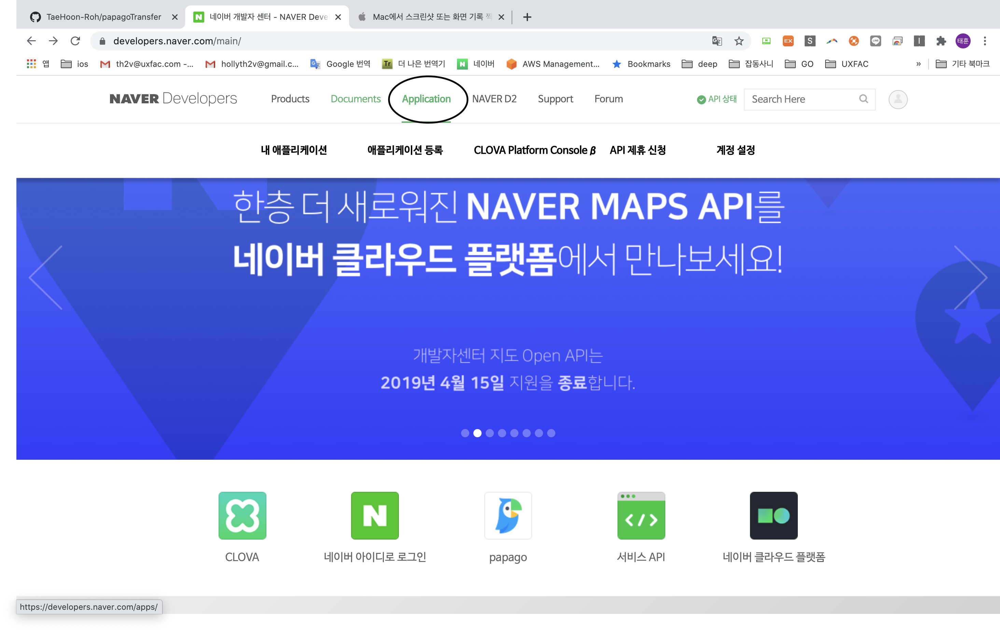
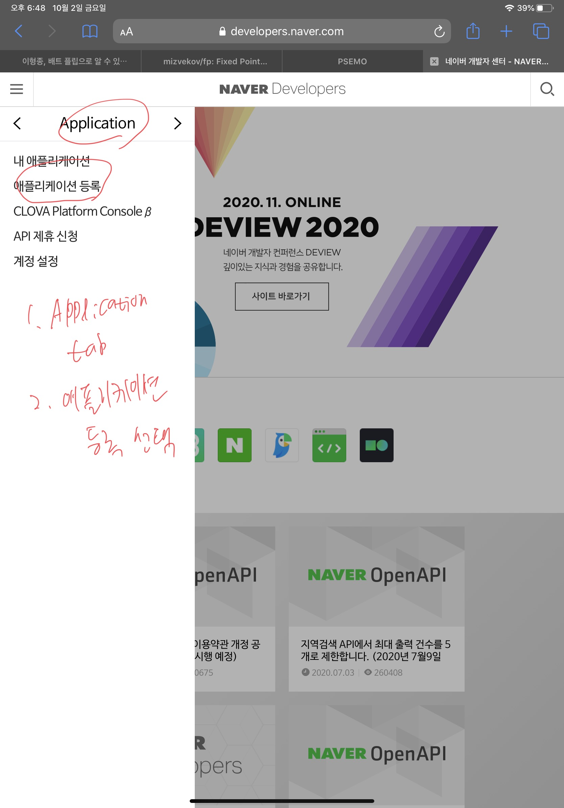
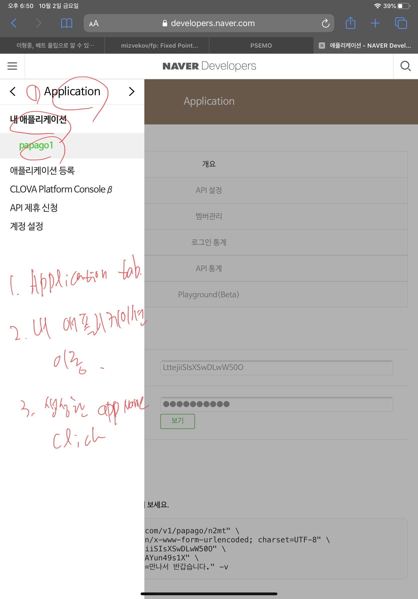
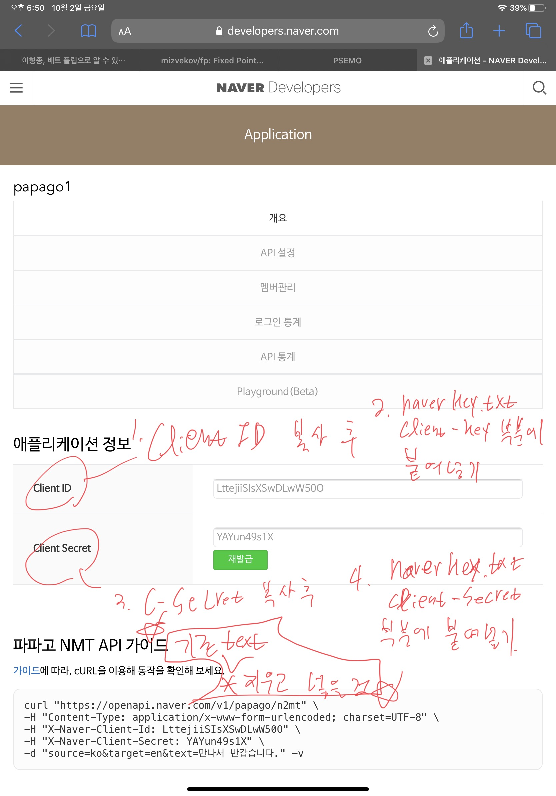
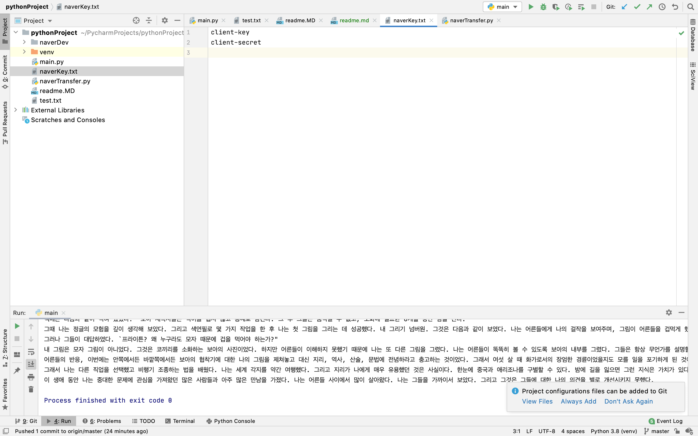
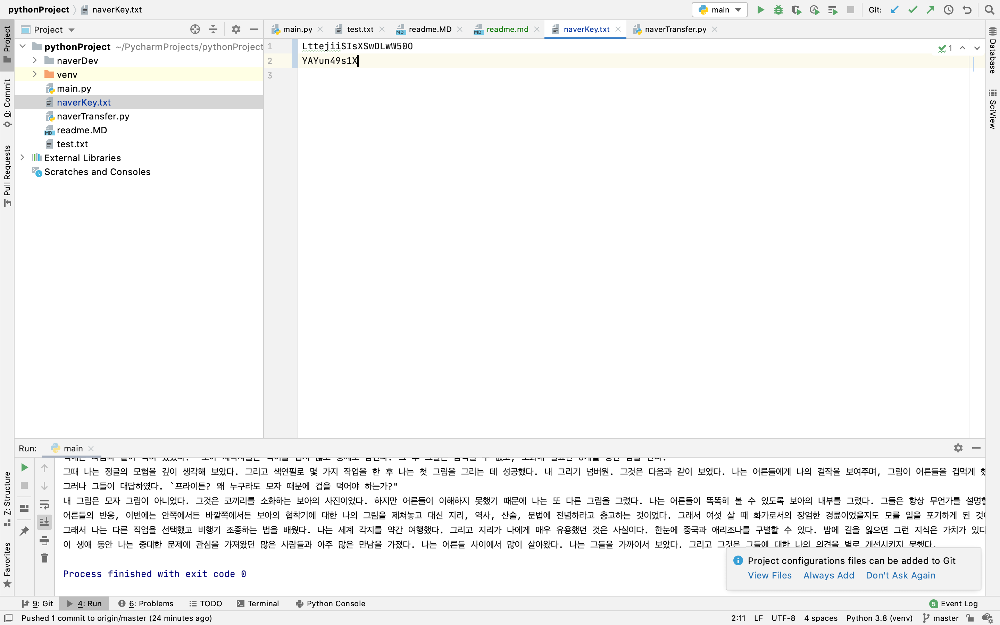
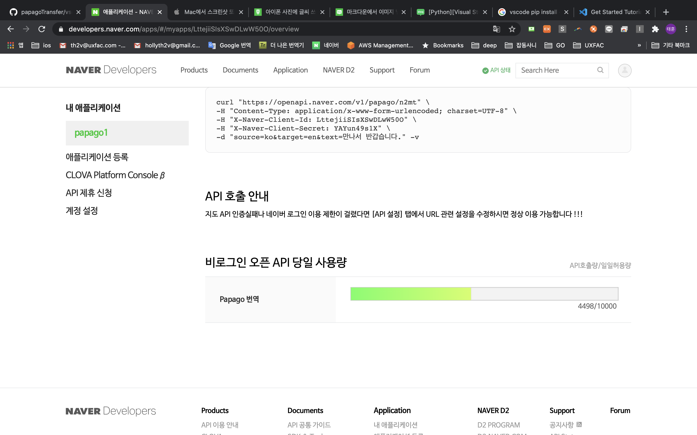

# Naver Developer 사용법

## Papago 유료 관련

https://www.ncloud.com/product/aiService/papagoNmt

## Papago Algorithm 관련

https://news.v.daum.net/v/20161110112405315

## Developer 활용 방법

### https://developers.naver.com/main/ 접속

* 잘 안되면 내 애플리케이션에서 비로그인 오픈 API 당일 사용량 확인
* 10000자 넘어가면 오류남
* 애플리케이션을 이름만 바꿔서 여러개 만들어도 가능
    * 이 경우는 키가 다르기 때문에 키를 바꿔줘야 함
    
    