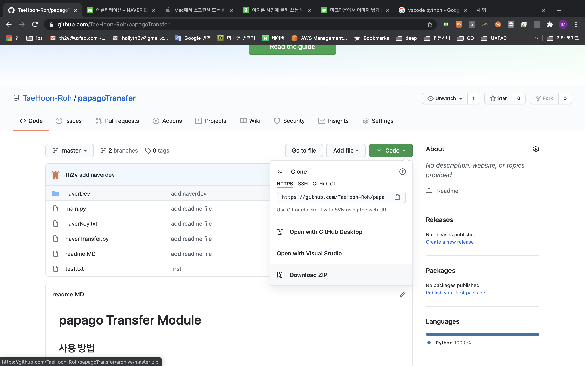
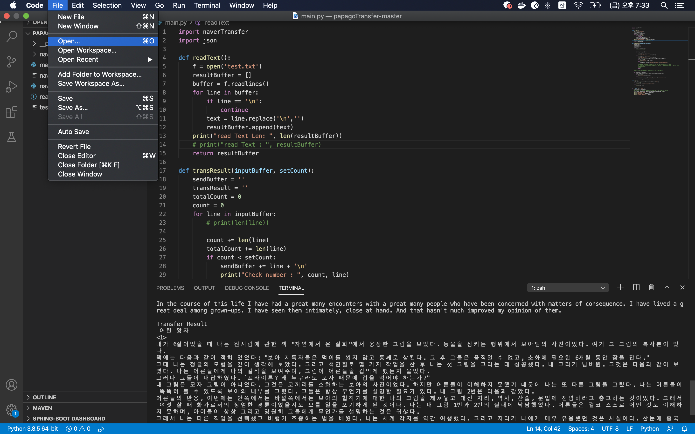
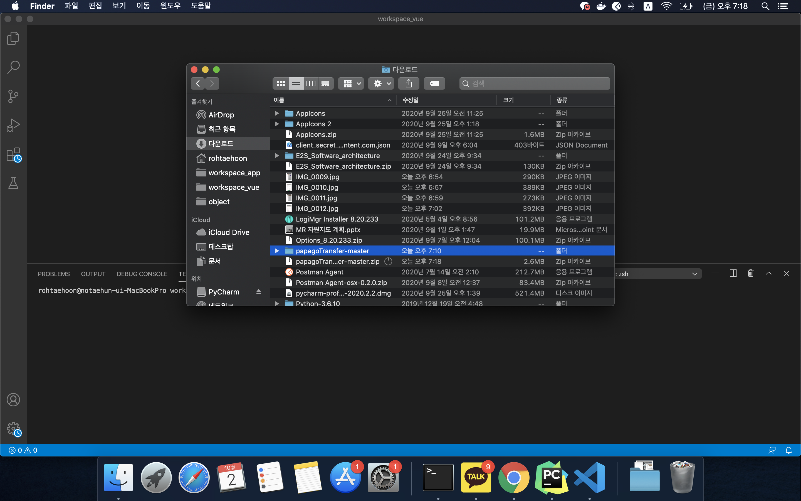
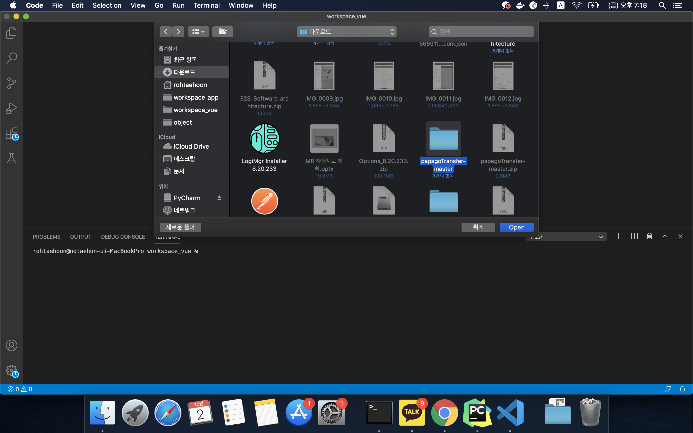
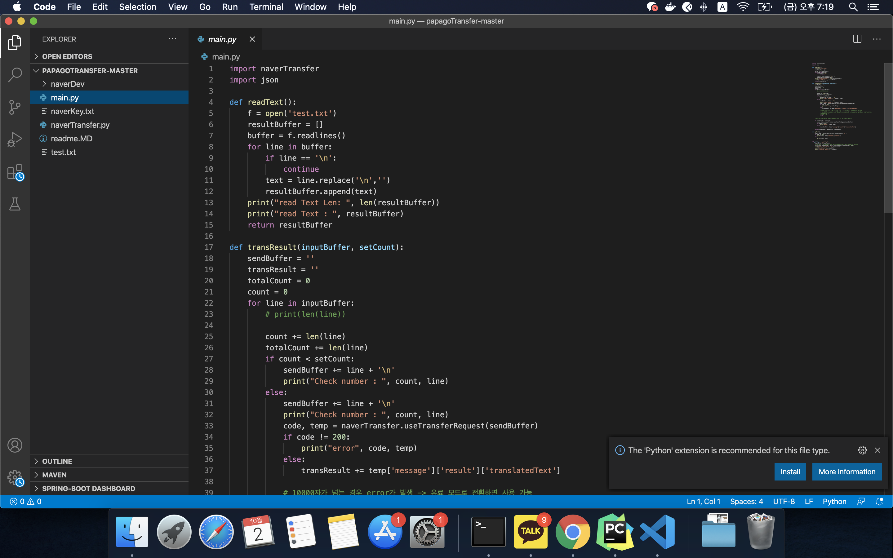
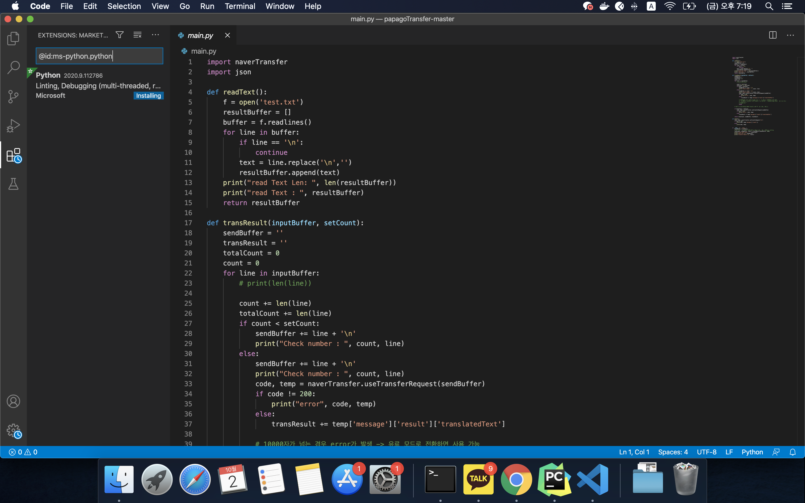
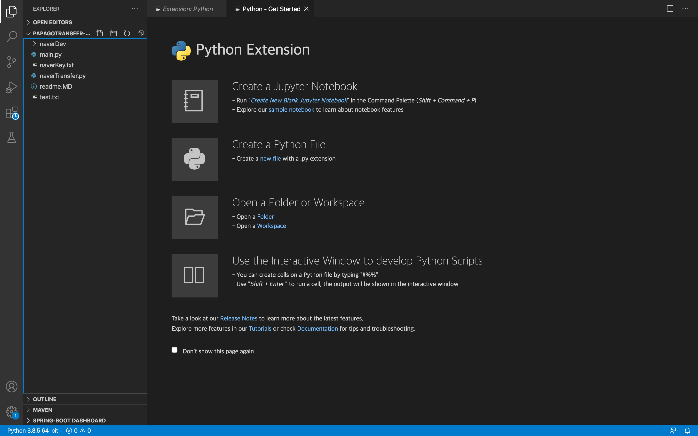
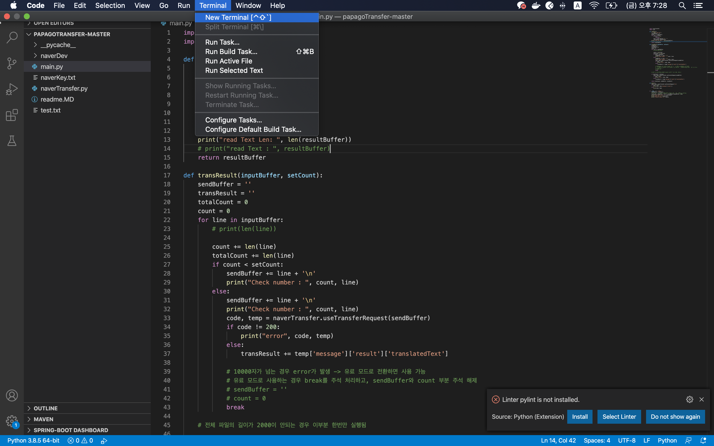
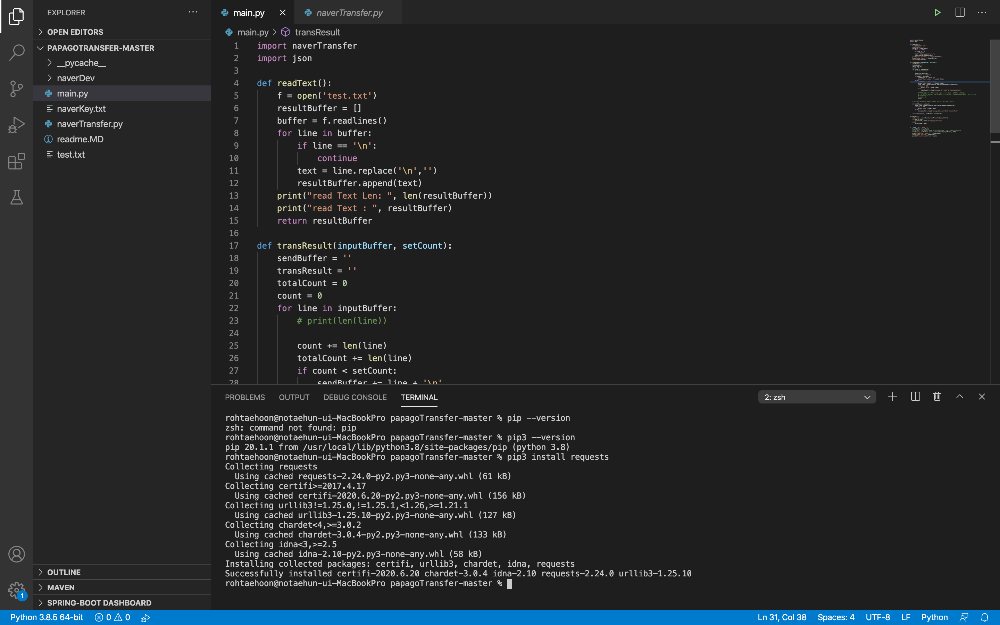
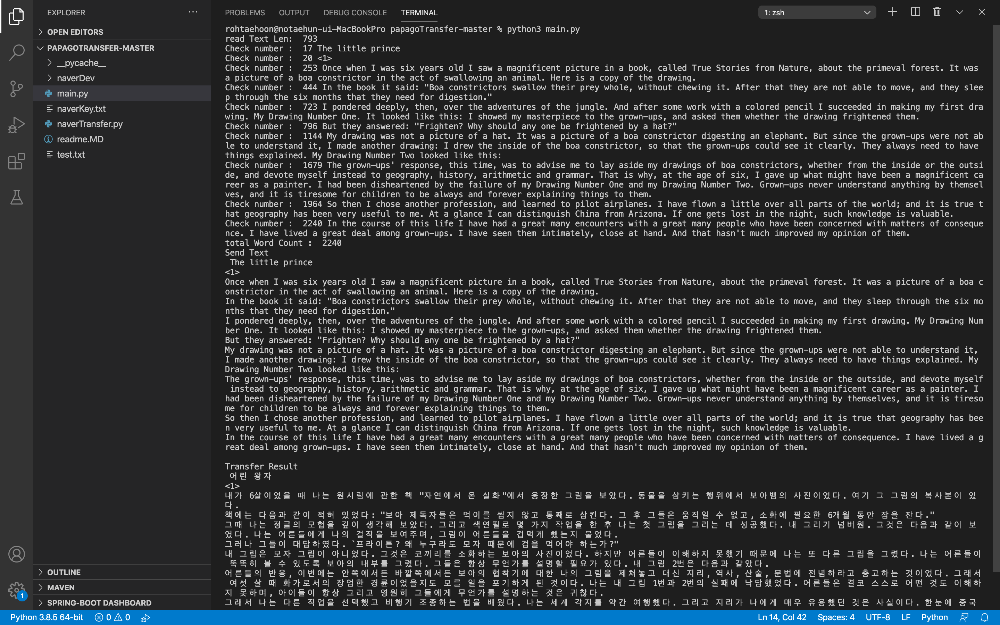

# VisualStudio Code 사용법

1. https://github.com/TaeHoon-Roh/papagoTransfer 접속

* code 선택
* Download zip 선택
* 원하는 폴더에 압축 해제

* vscode file tab
* open 선택

* 압축 해제 폴더 선
* open 선택

* 만약 python 설치가 뜬다면 install
* install 끝날때 까지 대기

* 새로운 터미널 생성

* pip 버전 확인
* pip --version 했는데 안뜨면 pip3 --version 해보기
* python 설치시 pip3 이 자동 설치되는게 정상
* pip3 --version 확인 후 pip3 install requests 입력
* requests 설치 완료

* 터미널에서 python3 main.py 실행
* 항상 main.py가 있는 폴더에서 실행시켜야 함